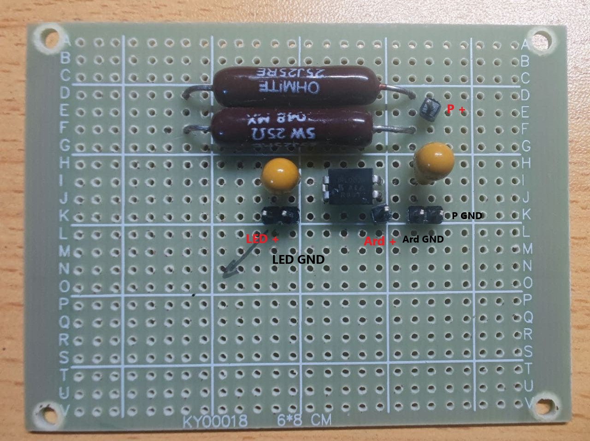
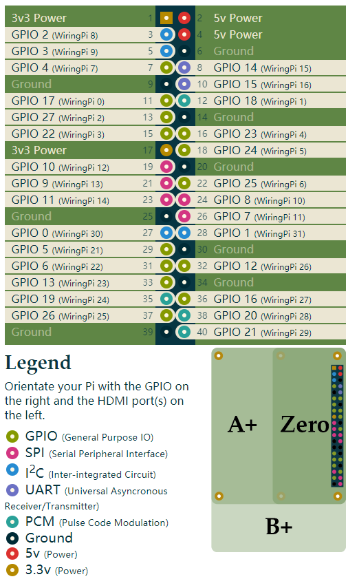

# 整体架构
**请注意，在描述时为便于区分逻辑架构及物理结构，将使用不同的术语：**

- **单元 -> 逻辑架构**
- **原件 -> 物理结构**

## 逻辑架构
在逻辑设计上，本系统主要由以下单元构成：
- 声刺激单元
    - 声刺激供电单元
    - 声刺激控制单元
    - 声刺激发生单元
- 光刺激单元
    - 声刺激供电单元
    - 声刺激控制单元
    - 声刺激发生单元
- 主要控制单元
    - 主控单元
    - 主控供电单元

两个刺激单元用于生成对应的刺激信号，而主要控制单元负责生成实验人员可读的操作界面，并在指定参数后协调配置两个刺激单元的工作，同时完成基础实验数据的记录。

## 物理结构
在物理实现上，本系统主要由以下原件组成：

- 供电原件
    - 主控及声刺激供电原件
        > 对应逻辑架构：声刺激供电单元 + 主控供电单元
    - 光刺激供电原件
        > 对应逻辑架构：光刺激供电单元
- 控制原件
    - 主控原件
        > 对应逻辑架构：主控单元
    - 声刺激控制原件
        > 对应逻辑架构：声刺激控制单元
    - 光刺激控制原件
        > 对应逻辑架构：光刺激控制单元
- 刺激发生原件
    - 声刺激发生原件
        > 对应逻辑架构：声刺激发生单元
    - 光刺激发生原件
        > 对应逻辑架构：光刺激发生单元

---

# 各原件说明
**以下说明主要围绕物理原件展开。**

*`规格要求` 一节中涉及的参数必须满足指定的要求，未提及的参数请自行根据实际情况确定。*

## 供电原件
供电原件主要负责为本系统中的各原件提供其工作所需的电力。

考虑到电力输入的多样性，以下只对供电时的输出相关进行要求，输入端请自行根据实际情况确定，但有以下建议：
1. 输入端尽量接地
2. 输入端尽量选用实验场地常用的电压及功率

### 主控及声刺激供电原件
#### 说明
同时为主控原件和声刺激控制原件两部分供电。由于声刺激控制原件与主控原件高度集成化且其内部电路自带集成供电（声刺激控制原件内置为主控原件供电的电路），故为简化实际电路将二者合并供电，实际走线中只需要将供电原件与声刺激控制原件连接即可。

#### 规格要求
- 输出电压：DC 12V
- 输出功率：> 40W
- 输出接口：5.5*2.5mm 通用 DC 插头

### 光刺激供电原件
#### 说明
考虑到光刺激单元部分的电压变化比较剧烈、功率较大且控制电路相对简单，故为其准备了独立的供电。
#### 规格要求
- 输出电压： DC 12V
- 输出功率：根据所用的灯带长度确定
- 输出接口：能够连接跳线即可


## 控制原件
控制原件主要负责根据接受的信号控制其下层电路原件的工作。

### 主控原件
#### 说明
主控选用了 Raspberry Pi 4B *（后文简称为 Raspberry）*。其上运行着主流程控制软件，负责生成实验人员易读的操作界面，并根据实验人员给定的参数控制与其连接的声刺激控制原件及光刺激控制原件。

**请注意：除了最基础的电路板，还需要为其配置一个 microSD 卡。**

#### 规格要求
具体型号：Raspberry Pi 4B
内存容量：> 1GB
microSD卡容量：> 16GB

### 声刺激控制原件
#### 说明
声控采用了 IQaudio DigiAMP+ *（后文简称为 IQaudio）*。负责转换主控发来的数字声音信号为模拟信号，经过放大处理后驱动声刺激发生原件工作。

#### 规格要求
具体型号：IQaudio DigiAMP+

### 光刺激控制原件
#### 说明
光刺激控制原件基于 [论文链接]() 中的电路，详细内容请参见论文。

#### 规格要求
参见 [论文链接]() 中电路部分的具体规格要求。


## 刺激发生原件
TODO:
### 声刺激发生原件
TODO:
#### 说明
TODO:
#### 规格要求
TODO:

### 光刺激发生原件
TODO:
#### 说明
TODO:
#### 规格要求
TODO:

# 硬件搭建说明

## 工具清单
- [ ] 电烙铁 1 个
- [ ] 螺丝刀若干（头部请根据需求自行选择）


## 耗材清单
- [ ] USB Type-A 插头 转 USB Type-B 插头 数据线 1 根 
- [ ] 焊锡若干
- [ ] 跳线若干
- [ ] 助焊剂若干
- [ ] 绝缘胶带若干

## 搭建步骤
### 1. 制作光刺激控制原件所需的自制电路板
> 具体要求及步骤请参考 [论文链接]() 中的内容

### 2. 连接自制电路板与 Arduino 板
> 此处仍沿用 [论文链接]() Figure 2b 中对自制电路板的标识+
> 具体请参照下图
> 
- 2.1 连接自制电路板的 Ard + 与 Arduino 板的 13 口
- 2.2 连接自制电路板的 Ard GND 与 Arduino 板的 GND 口（Arduino 有多个 GND 口，连接至其中一个即可）

### 3. 连接自制电路板与 LED 灯带
> 此处仍沿用 [论文链接]() Figure 2b 中对自制电路板的标识
- 3.1 连接自制电路板的 LED + 与 LED 灯带的正极
- 3.2 连接自制电路板的 LED GND 与 LED 灯带的负极

### 4. 连接自制电路板与变压器（光刺激供电原件）
> 此处仍沿用 [论文链接]() Figure 2b 中对自制电路板的标识
- 3.1 连接自制电路板的 P + 与变压器（光刺激供电原件）输出的正极
- 3.2 连接自制电路板的 P GND 与变压器（光刺激供电原件）输出的负极

### 5. 将 IQaudio 板安装至 Raspberry 板上
> 具体要求及步骤请参考 [iqaudio-product-brief](https://datasheets.raspberrypi.org/iqaudio/iqaudio-product-brief.pdf)

### 6. 连接 IQaudio 板与变压器（主控及声刺激供电原件）
将变压器输出口(5.5*2.5mm 通用 DC 插头)连接至 IQaudio 板电源输入口。

### 7. 连接 IQaudio 板与声刺激发声原件

### 7. 连接 Raspberry 板与 Arduino 板
- 7.1 取 USB Type-A 插头 转 USB Type-B 插头 数据线，连接 Raspberry 板（Type-A 插头接蓝色 USB3.0 插口）与 Arduino 板RESET-B 插头接对应插口）。

- 7.2 连接 Arduino RESET 与 Raspberry Wiringpi 21
- 7.3 连接 Arduino INPUT 8 与 Raspberry Wiringpi 22
> Arduino 板上会有明确的端口标识，Raspberry 板请参照下图
> 


# 软件设置说明
## 器材清单
- [ ] 电脑 1 台（需要联网）
- [ ] USB Type-A 插头 转 USB Type-B 插头 数据线 1 根
- [ ] microSD 读卡器 1 个
- [ ] 需要有无线网络

## 设置步骤

1. 在 microSD 卡上安装 Raspberry OS 系统
   > 具体内容参见 [Raspberry Pi Setup](https://www.raspberrypi.org/documentation/setup/)
2. 自行配置联网
3. 运行以下命令以升级系统
   ```
   # upgrade system
   sudo apt update
   sudo apt full-upgrade

   # upgrade eeprom
   sudo rpi-eeprom-update -a
   # rpi-eeprom-config --edit

   # upgrade wiringpi
   cd /tmp
   wget https://project-downloads.drogon.net/wiringpi-latest.deb
   sudo dpkg -i wiringpi-latest.deb
   cd -
   ``` 
4. 使用 git 下载代码（项目主页 https://github.com/WH-2099/Digital-Theraputics ），并进入其目录
   ```
   git clone https://github.com/WH-2099/Digital-Theraputics.git
   cd Digital-Theraputics/
   ```
5. 运行以下命令以安装所需的依赖
   ```
   sudo apt-get install -y python3-dev libasound2-dev
   sudo pip3 install -r requirements.txt
   ```

6. 将项目 `arduino` 下的代码上传至 Arduino
   > 具体内容参见 [Getting Started with Arduino UNO](https://www.arduino.cc/en/Guide/ArduinoUno)

## 运行步骤
1. 进入 `Digital-Theraputics` 目录
   ```
   cd Digital-Theraputics/
   ```
2. 启动主程序
   ```
   python3 main.py
   ```


## 紧急关闭
**1. 断开与 LED 灯带连接的变压器的供电**

**2. 断开与控制板连接的变压器的供电**

*一般情况下，该操作不会造成系统的硬件损坏，但软件的部分功能（如实验数据记录）可能受损！*
